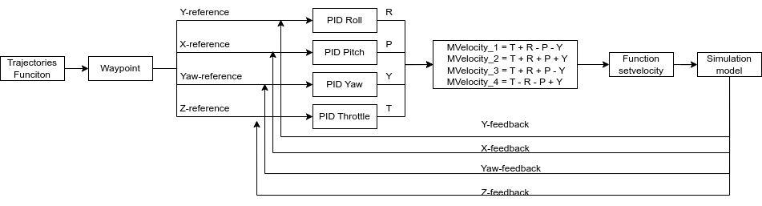

# Quadcopter simulation with Webots
Simulate quadcopter(Crazyflie) following waypoints using webbots
## Install 
* Download : ```git clone 
https://github.com/Mr-QB/Quadcopter-simulation-with-Webots.git```
* Install environment for webots:
    * Download Webots from [here](https://cyberbotics.com/)
    * Open Webots, click ```file```, select ```open world```,find the folder you just downloaded, select ```/Webots/worlds/FollowWaypointsDemo.wbt```.
## Control algorithm diagram:


## Demo
You can watch the resulting demo video here: https://www.youtube.com/watch?v=mdEw9gxru2g
